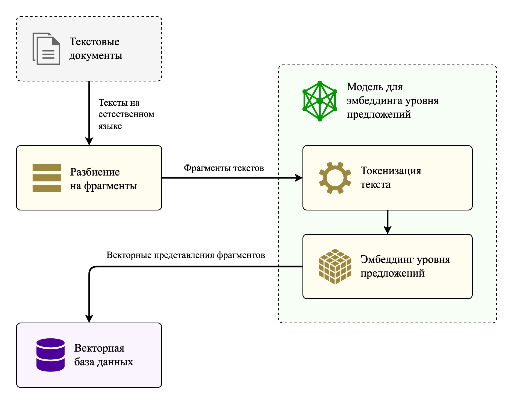
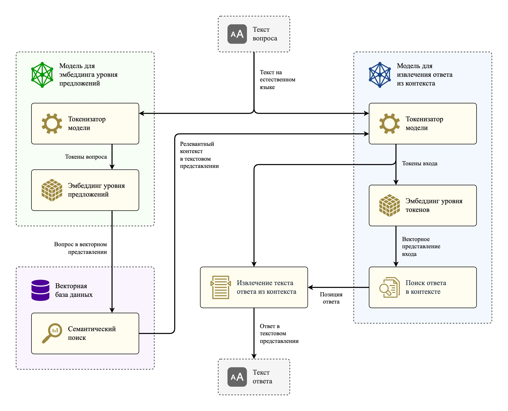
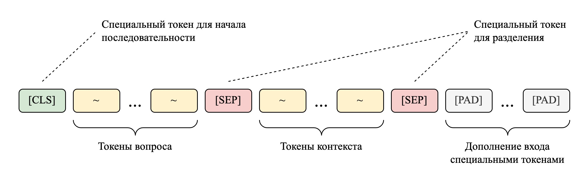

<h1>

<a href="README.md">🇺🇸</a>
<code>🇷🇺</code> 

Вопросно-ответная система
</h1>

Реализована в рамках магистерской дипломной работы. В основе системы используются [предобученные модели](https://arxiv.org/abs/2309.10931) с архитектурой трансформера (в частности, *ruBERT*), а для их тонкой настройки применяется алгоритм дифференциальной эволюции для подбора значений гиперпараметров оптимизатора *AdamW*. Для обучения используется набор данных [*SberQuAD*](https://huggingface.co/datasets/kuznetsoffandrey/sberquad).

## Принцип работы системы

Реализованная система способна отвечать на вопросы по загруженным в нее документам. Для этого в первую очередь необходимо сформировать базу знаний:

Документы разбиваются на небольшие фрагменты (например, по 500 символов), затем преобразуются в вектора с помощью модели эмбеддингов [*E5*](https://arxiv.org/abs/2402.05672), после чего отправляются в базу данных.

Ответ на вопрос по сформированной базе данных осуществляется по простой схеме:

Весь принцип работы делится на две части:
1. **Поиск контекста** (*слева на картинке*). Вопрос преобразуется в вектор через модель *E5*, затем в базе данных осуществляется поиск наиболее семантически близких к нему фрагментов. Близость определяется косинусной метрикой сходства.
2. **Извлечение ответа** (*справа на картинке*). Вопрос объединяется с найденным контекстом и отправляется в модель *ruBERT*, которая извлекает из всего входа только ответ.

Вход для модели *ruBERT* формируется следующим образом:

## Пример работы системы

`Вопрос:` Когда русские войска располагались у крепости Бранау?

`Ответ:` В октябре 1805 года

`Найденный контекст:` 
> ...и хорошо! - сказал он, сердито посмотрев на бесчувственную маленькую княгиню, укоризненно покачал головою и захлопнул дверь. 
ЧАСТЬ BTОРАЯ 
I 
<mark>В октябре 1805 года</mark> русские войска занимали села и города эрцгерцогства Австрийского, и еще новые полки приходили из России и, отягощая постоем жителей, располагались у крепости Браунау. В Браунау была главная квартира главнокомандующего Кутузова... 
© Война и мир. Том 1 (~37% книги)

## Структура репозитория

**Ноутбуки:**
- `chroma_preparing.ipynb` - формирование базы знаний вопросно-ответной системы с использованием библиотеки [Chroma](https://www.trychroma.com/) и романа "Война и мир", взятого в качестве примера;
- `ruBERT_AdamW_tuning.ipynb` - подбор значений для гиперпараметров оптимизатора *AdamW* при тонкой настройке *ruBERT* на наборе *SberQuAD*;
- `ruBERT_fine_tuning.ipynb` - тонкая настройка модели *ruBERT* со стандартными значениями гиперпараметров оптимизатора *AdamW*;
- `ruBERT_after_DE_fine_tuning.ipynb` - тонкая настройка модели *ruBERT* после подобра значений гиперпараметров для *AdamW* алгоритмом дифференциальной эволюции;
- `QA_system.ipynb` - объединенная вопросно-ответная система, соединяющая хранилище данных и модель для извлечения ответов;
- `QA_models_comparison.ipynb` - сравнение разных моделей для извлечения ответов из контекста на наборе данных *SberQuAD*.

**Папки:**
- `books/` - папка с четырьмя томами романа "Война и мир" в формате *.txt*, которые используются в качестве примера базы знаний системы;
- `assets/` - папка с изображениями для *README* и дополнительным файлом `schemes.drawio`, в котором представлены и другие схемы, относящиеся к этой работе, в том числе модели трансформера.