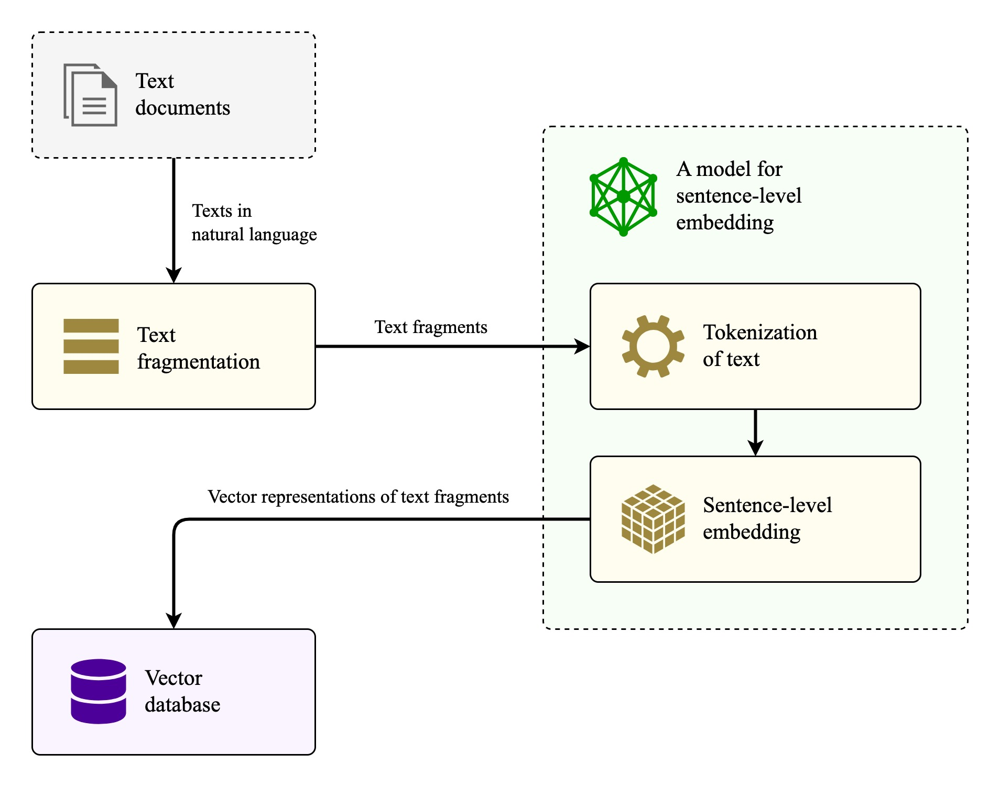
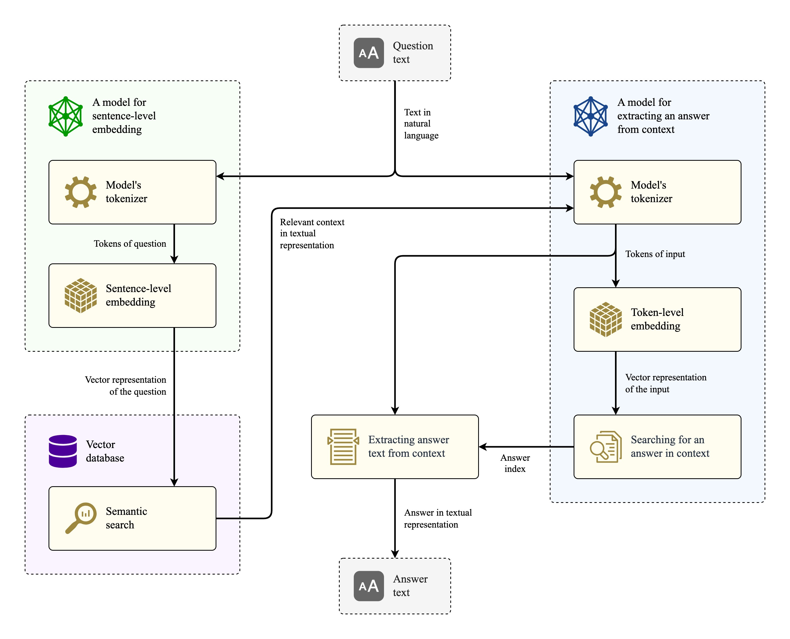
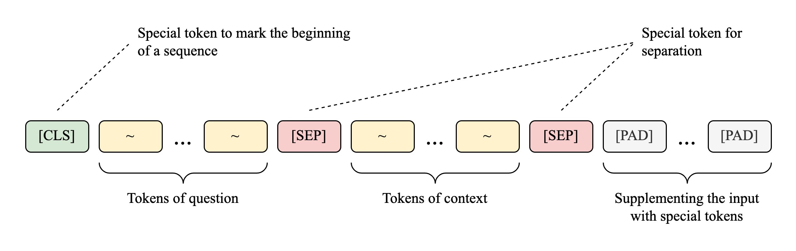

<h1>

<code>🇺🇸</code> 
<a href="README-RU.md">🇷🇺</a>

Question-answering system
</h1>

Implemented as part of a master's diploma work. The system is based on [pre-trained models](https://arxiv.org/abs/2309.10931) of transformer architecture (in particular, ruBERT), and for their fine-tuning the differential evolution algorithm is used to select values of hyperparameters of the AdamW optimizer. The [SberQuAD](https://huggingface.co/datasets/kuznetsoffandrey/sberquad) dataset is used for training.

## How it works

The implemented system is capable of answering questions on the documents loaded into it. For this purpose, first of all, it is necessary to form a knowledge base:

Documents are fragmented into small chunks (e.g., 500 characters each), then converted into vectors using the [E5](https://arxiv.org/abs/2402.05672) embedding model, before being sent to the vector database.

Answering a question using this vector database follows a simple scheme:

Question answering process consists of two parts:
1. **Search for the context** (*on the left side*). The question is converted into a vector via E5 model, then the most semantically similar fragments are searched in the vector database. The closeness is determined by the cosine similarity.
2. **Answer extraction** (*on the right side*). The question is combined with the found context and sent to the ruBERT model, which extracts only the answer from the whole input.

The input for the ruBERT model is formed as follows:

## Example of question answering <kbd>:ru:</kbd>

`Question:` Когда русские войска располагались у крепости Бранау?

`Answer:` В октябре 1805 года

`Found context:` 
> ...и хорошо! - сказал он, сердито посмотрев на бесчувственную маленькую княгиню, укоризненно покачал головою и захлопнул дверь. 
ЧАСТЬ BTОРАЯ 
I 
<mark>В октябре 1805 года</mark> русские войска занимали села и города эрцгерцогства Австрийского, и еще новые полки приходили из России и, отягощая постоем жителей, располагались у крепости Браунау. В Браунау была главная квартира главнокомандующего Кутузова... 
© War and Peace. Volume 1 (~37% of the book)

## Repository structure

**Notebooks:**
- `chroma_preparing.ipynb` - creating a knowledge base of question-answering system using [Chroma](https://www.trychroma.com/) library and the novel "War and Peace" taken as an example;
- `ruBERT_AdamW_tuning.ipynb` - selection of values for the hyperparameters of the AdamW optimizer when fine-tuning ruBERT on the SberQuAD dataset;
- `ruBERT_fine_tuning.ipynb` - fine-tuning of the ruBERT model with standard values of hyperparameters of the AdamW optimizer;
- `ruBERT_after_DE_fine_tuning.ipynb` - fine-tuning of the ruBERT model after selection the hyperparameter values for AdamW by the differential evolution algorithm;
- `QA_system.ipynb` - a united question-answering system that connects a data storage and a model for answer extraction;
- `QA_models_comparison.ipynb` - comparison of different models for extracting answers from context on the SberQuAD dataset.

**Folders:**
- `books/` - folder with four volumes of the novel "War and Peace" (in Russian) in *.txt* format, which are used as an example of the system's knowledge base;
- `assets/` - folder with images for the README and an additional *.drawio* file that contains other schemas related to this work, including Transformer models.